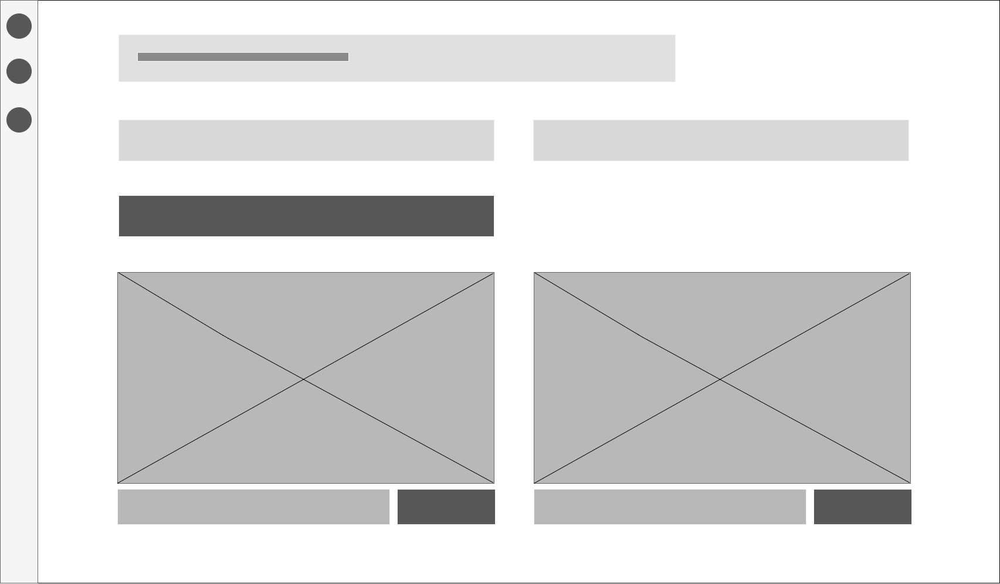
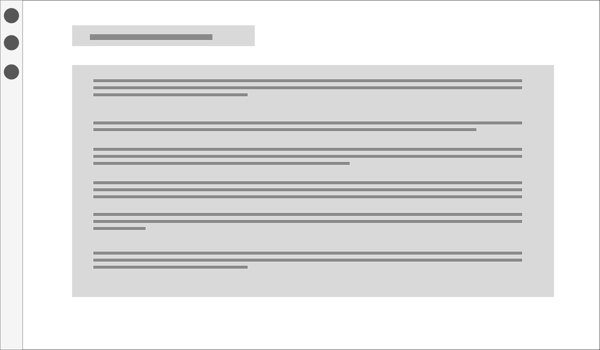
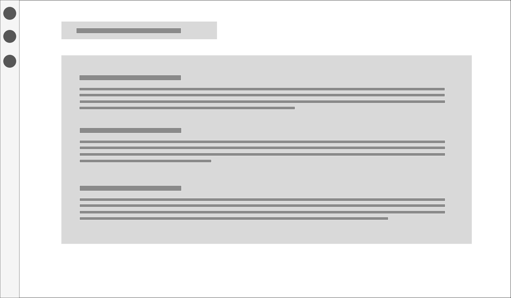

#  Report For Weather Data App 
### GUI Programming Assignment 2 - Milestone 1 By Johnny Kingi, Taylor Inglis, Olena Skeptor and Stephen Hewlett
 

##  Introduction 

This report covers the steps taken by our group to plan the development of an API (Application Programming Interface) that associates live weather data with cities located using Google Maps data. &nbsp;Team roles, online resources, wireframe representations, and the 'tools' or software used in developing the API, are all discussed.

 

##  Team Roles and Tasks 

The team leader for Group 2 is Johnny Kingi. &nbsp;Taylor Inglis, Olena Skeptor and Stephen Hewlett are the other members of the Group.

At our first team meeting on Monday, 4 September, we decided on the app we would develop. &nbsp;Olena took on the task of producing wireframes to represent the ideas sketched on paper during the meeting. &nbsp;Johnny, Stephen and Taylor committed to writing some 'user stories' to bring to class on Wednesday.

Roles were discussed further on 6 September. &nbsp;Johnny, Stephen and Taylor will work on the JavaScript and HTML coding to create twin APIs - one for the weather data and one for the map data. &nbsp;Olena displayed two wireframes she had drafted (beautiful work!!). &nbsp;The other team members contributed their thoughts and ideas on layout. &nbsp;Olena will complete the wireframes and has volunteered to do the CSS work for the API.  

Taylor and Johnny will continue doing research on API's. &nbsp;All team members have been doing this but more needs to be done as we work toward Milestone 2. &nbsp;Stephen is working on the MarkDown report.

 

##  Resources 

A number of online resources will be utilized in the operation of our app.

To obtain geographical data we will use the Google Maps APIs site. https://developers.google.com/maps

For weather data we will link to live data at the Open Weather Map site.
https://openweathermap.org/api

We expect to make use of Bootstrap to assist with formatting.
https://getbootstrap.com/docs/3.3/getting-started

We have considered sourcing other information for users to select a  __MORE__  option to learn about the location they have searched. &nbsp;That could mean using resources at:
https://www.mediawiki.org/wiki/API:Main_page,
&nbsp;and
https://www.mediawiki.org/wiki/API:Tutorial

We have viewed information on APIs available on YouTube, such as:
https://www.youtube.com/watch?v=7YcW25PHnAA, &nbsp;and the Coding Train
https://www.youtube.com/watch?v=ecT42O6I_WI&list=PLRqwX-V7Uu6a-SQiI4RtIwuOrLJGnel0r&index=5

Other API resources are available through:
https://www.programmableweb.com/

 

##  Wireframes 

The team agreed on 4 wireframes - a main page (or default page), one for resources, one for Help information, and one for Pop-Up information.

The wireframe for the main page features:
* A navigation bar
* Two input fields for the user
* A submit button
* Two containers displaying api data
* Button(s) to display a popup window containing additional city information

The navigation bar on the left will contain 3 buttons which link to a home page, information page and a help page. &nbsp;The information page will contain the resources used for creating and running the API and the help page will feature information on how to use the app. A pop up window will be used to dipslay further information about the city.

The wireframes were created in a Draw.IO file. &nbsp;They are displayed below:

####  Main Screen 

####  Pop Up window with more location information 
 
####  Help Screen 

####  Resources Screen 

We aim to keep the API simple and easy for the user, requiring only a handful of keystrokes to enter a city name followed by one click data retrieval. &nbsp;If more information is wanted then one more click will provide a list of resources, or further information about the city or the weather.

 

##  Tools 

To assist our Group with this project, we are using the following tools:
* Slack for communication
* Google Docs for textual content
* Draw.IO for diagrammatic content
* Visual Studio Code for textual content in MarkDown
* GitHub for creating and managing our repositories

We considered other tools, such as Office365, which offers MS Word and Visio. &nbsp;The team members were uncommitted to one or the other, but most were satisfied with Google Docs for ease of access. &nbsp;We also talked about using BitBucket, or GitHub. &nbsp;Again, most team members did not have a strong preference, and so we went with the team leader's preference. &nbsp;We briefly touched on other communication options before settling on Slack.

Another tool we discussed and may yet utilize is Trello. &nbsp;Olena, who uses this application at her work, demonstrated it to the group. &nbsp;It is clearly a very useful tool for itemizing and tracking project components.

 

##  Conclusion 

Milestone 1 has provided the group with a constructive and stimulating process for collating our ideas and planning how to devise an API. &nbsp;Having completed the groundwork, we look forward to the challenge of turning our plans into reality.
